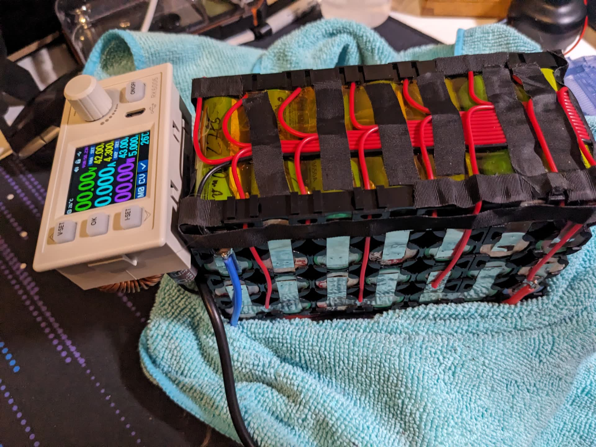
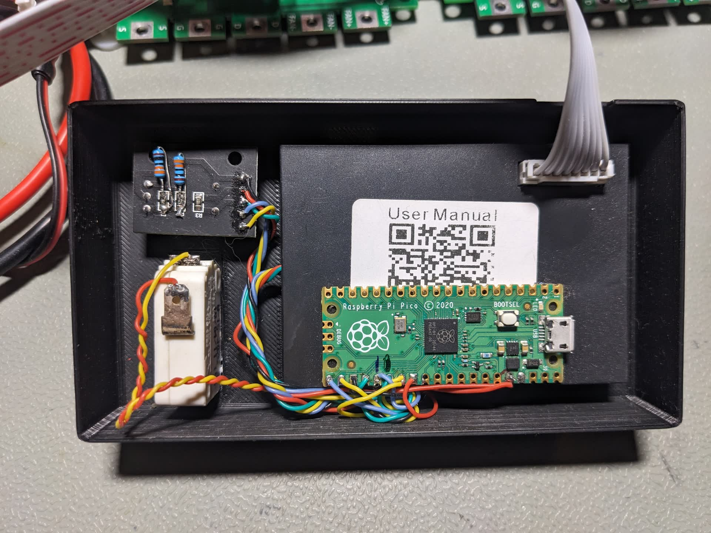
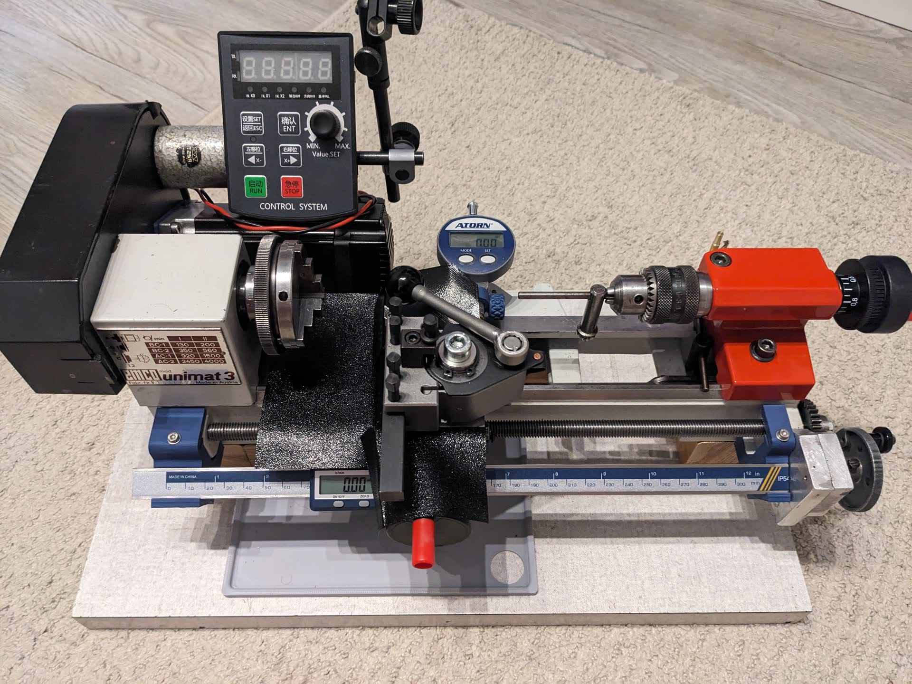
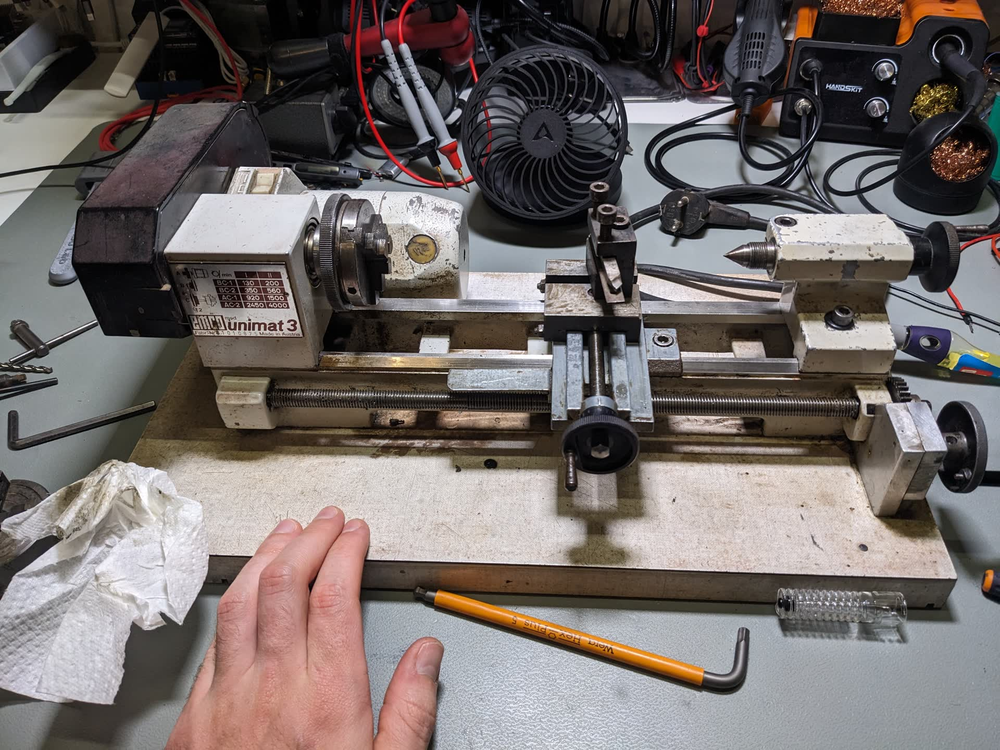
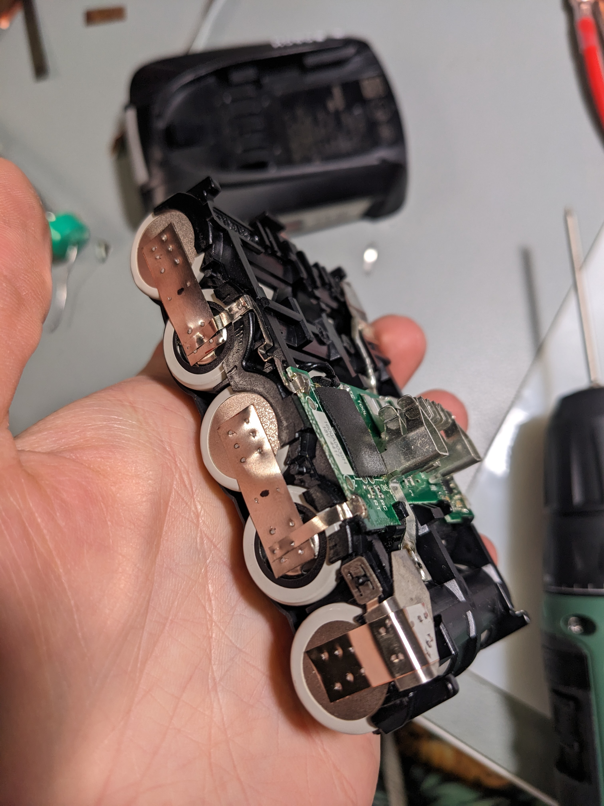
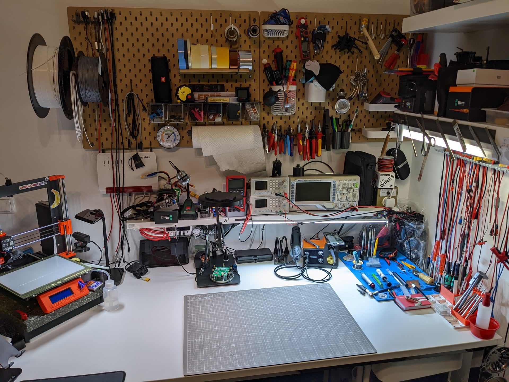
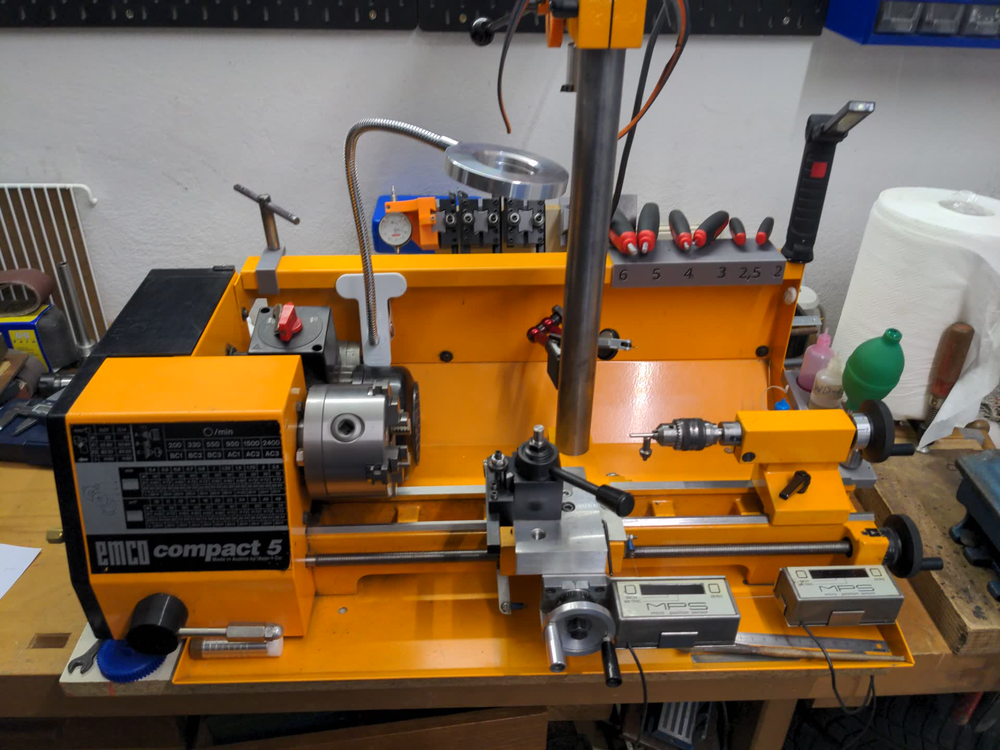

Welcome to my portfolio! Here, you'll find an overview of my hardware and software projects. Each project includes a brief description, goals, key technologies used, and links to repositories or pictures.

## 🚀 Featured Projects

### **Mobile Battery-supplied Lab Power Supply**
- **Description:** This supply can power anything up to 55 Volts and 6 Amps, while being completely mobile. It combines a 14s2p spot welded battery made of recycled 18650 cells, with an adjustable DC-DC converter in a 3D printed enclosure.  In total the supply comes in under 2 kg and can deliver maximum power for about an hour (~300 Wh of energy).
- **Goals:** Backup-charge my e-scooter from 0-100 % SoC within 2 hrs
- **Technologies Used:**  Spot welding, 3D printing, DC-DC buck conversion, Soldering, CAD 

### **Hacked electronic load**
- **Description:** 
- **Goals:** Improved usability with separate UI board and a rotary encoder
- **Technologies Used:**  Raspberry Pi Pico, Rotary Encoder, 3D Printing, CAD, Soldering

## 💻 Past Projects
 
### **Electroluminescence meaurements of PV panels**
- **Description:** 
- **Goals:** 
- **Technologies Used:**  

### **Restoration and modification of Emco Unimat 3 Lathe**
- **Description:** 
- **Goals:** 
- **Technologies Used:**  
- **After:** 
- **Before:** 

### **Rejuvenating old Bosch battery packs**
- **Description:** 
- **Goals:** Improved capacity and internal resistance of my Bosch batteries.
Insights into spot welding and specifically copper-nickel sandwhich welds.
Preparation of used batteries for lower demand projects.
- **Technologies Used:**  Spot welding

### **Hacked humidifier with active control**
- **Description:** 
- **Goals:** Operation withing optimal humidity range (60-80 %RH) to promote tropical plant growth
- **Technologies Used:**  Raspberry Pi Pico, OLED Display, 3D Printing, Temp and Humidity Sensing

<h3>Babywalker for my niece<h3>

	<ul>
	  <li>Description:</li>
	  <li>Goals:</li>
	  <li>Technologies Used:</li>
	</ul>

  
<h2>📝 Blog & Tutorials</h2>
 
- [Article 1: Building a Custom PCB](#)

## 📫 Contact & Links
- **Email:** cfuchsey@gmail.com
- **GitHub:** [github.com/OutFoxD](https://github.com/outfoxd)
- **Printables:** [printables.com/@OutFoxD/models](https://www.printables.com/@OutFoxD/models)
- **Thingiverse:** [thingiverse.com/outfoxd/designs](https://www.thingiverse.com/outfoxd/designs)

## ✨ Where the magic happens ✨
- In my home Lab:

- in my [local Maker Space](https://grandgarage.eu/)
- or in my Dad's Workshop 
